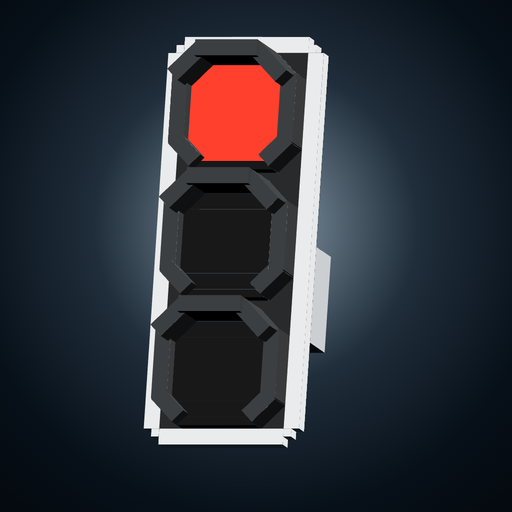

# JINZAI Traffic Lights



## English

Platform: Fabric  
Minecraft: 1.20.1

This mod received art assets and funding support from "Crzayjinzai", with technical implementation and production by "QiZhang". Copyright in the art assets belongs to "Crzayjinzai"; copyright in the mod code and configuration belongs to "QiZhang".

### Mod Introduction

JINZAI Traffic Lights is a decorative expansion mod for city building. Version 1.0.32 retains every phase-one block and all 58 phase-two models, for 161 blocks in total. Ten complex traffic-light models now use one enclosing box matching each complete placed model volume for their selection and physical collision. This update retains the four optimized models from version 1.0.31 and adds the same optimization to six four-lens and solar-warning models, reducing the outline workload when aiming at them; the other 151 blocks retain their previous collision behavior. You can freely combine traffic-light frames, indicator lights, illuminated annex decorations and poles into different aesthetics, or use them alongside other city and traffic decoration mods to build your own city.

> **Note:** Due to current development limitations, dynamic traffic lights and customizable signal control are not available in the current release. These features may be added in the future.

### Block Introduction

- **Traffic Light Frames:** 48 frame and frame-component blocks, including the original designs plus Taipei-style, four-lens, dual-assembly, mobile, solar-warning and pedestrian styles.
- **Indicator Blocks:** 55 static indicator and decorative lighting blocks, including four-lens, dual-assembly, mobile and pedestrian signals. They can be placed in front of traffic-light frames.
- **Decorative Poles:** 48 pole and pole-component blocks inspired by Guangzhou, Hangzhou, Taipei and other cities. They can be freely combined with this mod or other city traffic decoration mods.
- **Traffic Light Accessories:** 10 illuminated, pass-through ground signals and horizontal/vertical LED traffic-light strips. These blocks have their own creative tab named **Traffic Light Accessories**.

### Update Roadmap

- Fabric 1.20.1 is supported now. Forge support remains planned.
- NeoForge is not currently supported because of serious mod compatibility conflicts. Support for Minecraft 1.21.1 and newer, as well as other game versions, will be considered according to player demand.
- Future content may include more traffic-light styles and supporting decorations, including dynamic traffic lights, warning lights and British-style traffic lights.

### Current Release Features

- Every block supports the four horizontal orientations and faces the player when placed.
- Frame and pole collision shapes are generated from their Blockbench model elements and rotate with the block. Angled elements are subdivided into cells no larger than one model unit to reduce empty-corner collision.
- Ten complex models each use one enclosing model-volume collision box: the Dual-Assembly Frameless, Mobile, Dual-Assembly Rectangular-Frame, Dual-Assembly Round-Frame, Frameless Four-Lens, Square-Framed Four-Lens, Vintage Four-Lens, Taipei Four-Lens, Solar Warning and Dual Solar Warning traffic lights. Version 1.0.32 adds the last six models to the four already optimized in version 1.0.31; the other 151 blocks retain their previous collision behavior.
- Indicators and traffic-light annexes retain a model-aligned selection outline but have no physical collision, allowing players and entities to pass through them.
- Indicators and traffic-light annexes remain illuminated and do not include countdowns, automatic cycling, or redstone control.
- All 161 items include localized names, descriptions, item models, creative groups, and self-drop loot tables.
- Content is organized into four localized creative groups: Traffic Light Frames, Traffic Light Indicators, Traffic Light Poles, and Traffic Light Accessories. Only the 10 accessory blocks appear in the accessory tab; all other phase-two blocks use the existing categories.
- The mod includes 13 complete languages and automatically follows the language selected in Minecraft: English, Simplified Chinese, Spanish, Hindi, Arabic, French, Brazilian Portuguese, Russian, Indonesian, German, Japanese, Turkish, and Korean.

### Installation

1. Install Minecraft 1.20.1.
2. Install Fabric Loader 0.17.2 or a newer compatible release.
3. Install Fabric API 0.92.6+1.20.1 or a newer compatible release.
4. Place `JINZAI_Trafficlights-Fabric-1.20.1-1.0.32.jar` in the instance's `mods` folder.
5. Remove every older JAR of this mod first, including version 2.0.0 or the demo, so duplicate copies with the same mod ID are not loaded together.

The mod targets Java 17 bytecode and declares Java 17 or newer. It can be loaded by Java 17–25; development-client startup has been tested with Java 17, Java 21 and Java 25. Compatibility of the Minecraft instance and other mods is still required when using newer Java releases.

### Building from Source

On Windows:

```powershell
.\gradlew.bat clean build
```

The release is written to `build/libs/JINZAI_Trafficlights-Fabric-1.20.1-1.0.32.jar`. The final version segment comes from `mod_version` in `gradle.properties`. Gradle/Loom may run on Java 21 while still producing Java 17 bytecode.

Regenerate and verify all resources with:

```powershell
python tools/generate_full_resources.py
python tools/verify_full_resources.py
```

---

# 津仔的交通灯

## 中文

平台：Fabric  
Minecraft：1.20.1

本模组由"Crzay津仔"提供美术与资金支持，"QiZhang"提供技术实现与制作。美术素材版权归 "Crzay津仔"所有，模组代码/配置版权归"QiZhang"所有。

### 模组介绍

津仔的交通灯是一个面向城建装饰的扩展模组。1.0.32 版本完整保留一期全部方块和二期新增的 58 个模型，共有 161 个方块。现在共有 10 个复杂红绿灯模型分别使用 1 个贴合完整放置模型体积的选择与物理碰撞外包箱。本次更新保留 1.0.31 已优化的 4 个模型，并为另外 6 个四孔型与太阳能警示灯模型加入相同优化，以降低准星对准时的轮廓计算负担；其余 151 个方块保持原有碰撞行为。你可以自由搭配红绿灯框架、指示灯、发光附属装饰和杆子，也可以搭配其他城市与交通装饰模组，打造属于自己的城市。

> **注意：** 受当前开发能力限制，当前版本暂不包含动态红绿灯和自定义交通信号控制，相关功能可能在未来加入。

### 方块介绍

- **红绿灯框架：** 共 48 个框架与配套部件，在一期设计基础上增加台北式、四孔型、双组合、移动式、太阳能警示灯和人行道等风格。
- **指示灯方块：** 共 55 个静态指示灯与照明装饰方块，新增四孔型、双组合、移动式和多种人行道信号，可放置在红绿灯框架前方。
- **杆子装饰：** 共 48 个杆子与杆件方块，设计参考广州、杭州、台北等城市，可与本模组或其他城市交通装饰模组自由搭配。
- **交通灯附属：** 共 10 个发光且可穿透的地面式交通灯和横/竖型 LED 交通灯条，单独收录在名为“交通灯附属”的创造模式标签页中。

### 更新计划

- 当前已支持 Fabric 1.20.1，Forge 版本仍在计划中。
- 由于当前存在严重的模组兼容冲突，目前暂不支持 NeoForge。Minecraft 1.21.1 及更高版本和其他游戏版本，将根据玩家需求决定是否支持。
- 未来可能加入更多风格的红绿灯与辅助装饰，包括动态红绿灯、警示灯和英式红绿灯。

### 当前版本功能

- 所有方块均支持东、南、西、北四个水平方向，并在放置时朝向玩家。
- 框架和杆件的碰撞箱由各自 Blockbench 模型元素生成，随方块朝向同步旋转；倾斜元素按不超过 1 个模型单位细分，以减少斜杆四角的空白误碰。
- 共 10 个复杂模型各使用 1 个覆盖完整模型体积的外包碰撞箱：“双组合无框红绿灯”“移动式红绿灯”“双组合正框红绿灯”“双组合圆框红绿灯”“无框四孔红绿灯”“正框四孔红绿灯”“复古四孔红绿灯”“台北四孔红绿灯”“太阳能警示灯”“太阳能双警示灯”。1.0.32 在 1.0.31 已优化的 4 个模型基础上新增优化后 6 个模型，其余 151 个方块保持原有碰撞行为。
- 指示灯和交通灯附属具有模型对齐的选择框，但物理碰撞为空，可被玩家和实体穿过。
- 指示灯和交通灯附属固定发光，不含倒计时、自动切灯或红石控制。
- 全部 161 个物品均有本地化名称、提示描述、物品模型、创造模式分类和自身掉落表。
- 内容分为“红绿灯框架”“指示灯”“杆子”“交通灯附属”四个本地化创造模式物品栏；附属页只包含新增的 10 个附属模型，其他二期模型继续放入原有分类。
- 模组完整支持 13 种语言，并根据 Minecraft 当前选择的语言自动切换：英语、简体中文、西班牙语、印地语、阿拉伯语、法语、巴西葡萄牙语、俄语、印度尼西亚语、德语、日语、土耳其语和韩语。

### 安装

1. 安装 Minecraft 1.20.1。
2. 安装 Fabric Loader 0.17.2 或更高兼容版本。
3. 安装 Fabric API 0.92.6+1.20.1 或更高兼容版本。
4. 将 `JINZAI_Trafficlights-Fabric-1.20.1-1.0.32.jar` 放入游戏实例的 `mods` 文件夹。
5. 请先移除本模组的所有旧 JAR（包括 2.0.0 或演示版），避免相同模组 ID 的多个版本同时加载。

模组使用 Java 17 字节码并声明 Java 17 或更高版本，可由 Java 17–25 加载；开发客户端已实际通过 Java 17、Java 21 与 Java 25 启动测试。使用更高 Java 版本时，仍需确保游戏实例及其他模组兼容。

### 从源码构建

Windows：

```powershell
.\gradlew.bat clean build
```

构建产物位于 `build/libs/JINZAI_Trafficlights-Fabric-1.20.1-1.0.32.jar`。文件名末尾版本号取自 `gradle.properties` 中的 `mod_version`；Gradle/Loom 可使用 Java 21 驱动，输出仍固定为 Java 17 字节码。

使用以下脚本重新生成并验证全部资源：

```powershell
python tools/generate_full_resources.py
python tools/verify_full_resources.py
```
