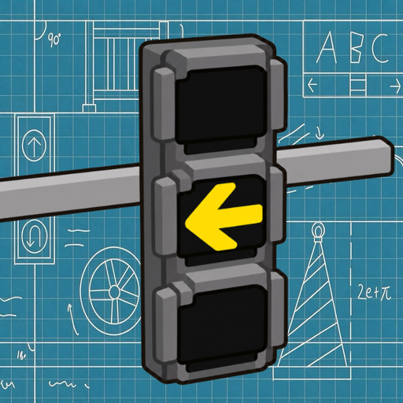

# JINZAI Traffic Lights



## English

Platforms: Fabric and Forge (shared Architectury codebase)  
Minecraft: 1.20.1  
Mod version: 2.0.33  
Java bytecode: 17

This mod received art assets and funding support from "Crzay津仔", with technical implementation and production by "QiZhang". Copyright in the art assets belongs to "Crzay津仔"; copyright in the mod code and configuration belongs to "QiZhang".

### Introduction

JINZAI Traffic Lights is a decorative expansion mod for city building. It retains all 103 phase-one blocks and all 58 phase-two blocks, for 161 blocks in total:

- 48 traffic-light frames and frame components.
- 55 static indicators and decorative lights.
- 48 poles and pole components.
- 10 illuminated, pass-through traffic-light accessories in their own **Traffic Light Accessories** creative tab.

All registry IDs, blockstates, models, textures, loot tables and collision data remain compatible with the Fabric 1.0.32 content baseline. Version 2.0.33 moves the implementation into `common`, `fabric` and `forge` modules so future additions can be synchronized across both loaders.

Ten previously optimized complex models use one enclosing box matching the complete placed model volume: Dual-Assembly Frameless, Mobile, Dual-Assembly Rectangular-Frame, Dual-Assembly Round-Frame, Frameless Four-Lens, Square-Framed Four-Lens, Vintage Four-Lens, Taipei Four-Lens, Solar Warning and Dual Solar Warning. The other 151 blocks retain their prior collision behavior.

Indicators and accessories remain illuminated and have no physical collision. Dynamic signals, countdowns, automatic cycling and redstone-controlled signal logic are not included.

The mod provides localized block and creative-tab names in 13 languages and follows the language selected in Minecraft: English, Simplified Chinese, Spanish, Hindi, Arabic, French, Brazilian Portuguese, Russian, Indonesian, German, Japanese, Turkish and Korean. Items intentionally show only their localized names; no additional item tooltip notes are added.

### Installation

Fabric:

1. Install Fabric Loader 0.17.2 or a newer compatible release for Minecraft 1.20.1.
2. Install Fabric API 0.92.6+1.20.1 and Architectury API 9.0.6 through versions earlier than 10.0.0. The supplied and verified 9.2.14 release is recommended.
3. Put `JINZAI_Trafficlights-Fabric-1.20.1-2.0.33.jar` in the instance's `mods` folder.

Forge:

1. Install Forge 47.x for Minecraft 1.20.1.
2. Install Architectury API 9.0.6 through versions earlier than 10.0.0. The supplied and verified 9.2.14 release is recommended.
3. Put `JINZAI_Trafficlights-Forge-1.20.1-2.0.33.jar` in the instance's `mods` folder.

Remove older copies of this mod before launching so two JARs with the same mod ID are not loaded together.

### Build and verify

```powershell
.\gradlew.bat clean build
```

The public source retains the original art files and all pre-generated runtime
resources. Private non-build documents and workbooks are not part of the public
source package. The resource generator and full art audit remain in `tools/`
for development reference and require separately maintained private inputs;
they are not public-package acceptance commands.

Release JARs:

```text
fabric/build/libs/JINZAI_Trafficlights-Fabric-1.20.1-2.0.33.jar
forge/build/libs/JINZAI_Trafficlights-Forge-1.20.1-2.0.33.jar
```

---

# 津仔的交通灯

## 中文

平台：Fabric 与 Forge（共享 Architectury 代码）  
Minecraft：1.20.1  
模组版本：2.0.33  
Java 字节码：17

本模组由"Crzay津仔"提供美术与资金支持，"QiZhang"提供技术实现与制作。美术素材版权归 "Crzay津仔"所有，模组代码/配置版权归"QiZhang"所有。

### 模组介绍

津仔的交通灯是一个面向城建装饰的扩展模组，完整保留一期103个方块和二期58个方块，共161个：

- 48个红绿灯框架与框架部件。
- 55个静态指示灯与照明装饰。
- 48个杆子与杆件部件。
- 10个发光且可穿透的交通灯附属，单独位于“交通灯附属”创造标签页。

全部注册ID、方块状态、模型、贴图、掉落表和碰撞数据与Fabric 1.0.32内容基线兼容。2.0.33将实现整理为`common`、`fabric`和`forge`三个模块，方便今后在两个加载器之间同步新增内容。

此前已优化的10个复杂模型继续使用1个覆盖完整放置模型体积的外包碰撞箱：“双组合无框红绿灯”“移动式红绿灯”“双组合正框红绿灯”“双组合圆框红绿灯”“无框四孔红绿灯”“正框四孔红绿灯”“复古四孔红绿灯”“台北四孔红绿灯”“太阳能警示灯”“太阳能双警示灯”。其余151个方块保持此前碰撞行为。

指示灯与交通灯附属固定发光且没有物理碰撞。当前不包含动态信号、倒计时、自动切灯或红石控制信号逻辑。

模组提供13种语言的方块名称和创造标签页名称，并根据Minecraft当前语言自动切换：英语、简体中文、西班牙语、印地语、阿拉伯语、法语、巴西葡萄牙语、俄语、印度尼西亚语、德语、日语、土耳其语和韩语。物品按要求只显示本地化名称，不额外添加物品备注提示。

### 安装

Fabric：

1. 安装Minecraft 1.20.1对应的Fabric Loader 0.17.2或更高兼容版本。
2. 安装Fabric API 0.92.6+1.20.1和Architectury API 9.0.6至低于10.0.0的版本；随包提供且已经验证的9.2.14版本为推荐版本。
3. 将`JINZAI_Trafficlights-Fabric-1.20.1-2.0.33.jar`放入实例的`mods`文件夹。

Forge：

1. 安装Minecraft 1.20.1对应的Forge 47.x。
2. 安装Architectury API 9.0.6至低于10.0.0的版本；随包提供且已经验证的9.2.14版本为推荐版本。
3. 将`JINZAI_Trafficlights-Forge-1.20.1-2.0.33.jar`放入实例的`mods`文件夹。

启动前请移除本模组旧版本，避免同时加载两个具有相同模组ID的JAR。

### 构建与校验

```powershell
.\gradlew.bat clean build
```

公开源码保留原始美术文件和全部已生成运行资源。私有且不参与构建的说明文档与
工作表不属于公开源码包。`tools/`中的资源生成器和完整美术审计工具作为开发参考
保留，运行时需要另行维护私有输入，不作为公开源码包的验收命令。

正式JAR：

```text
fabric/build/libs/JINZAI_Trafficlights-Fabric-1.20.1-2.0.33.jar
forge/build/libs/JINZAI_Trafficlights-Forge-1.20.1-2.0.33.jar
```
