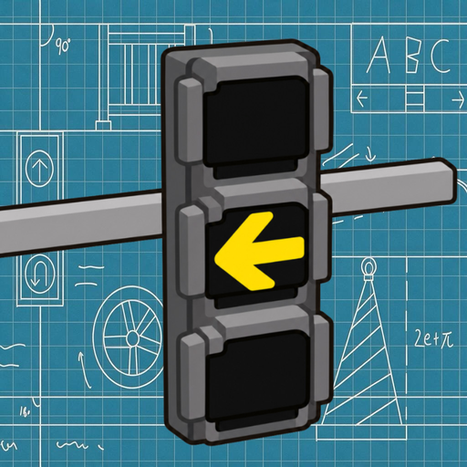

# JINZAI Traffic Lights



## English

Platforms: Fabric and Forge (shared Architectury codebase)  
Minecraft: 1.20.1  
Mod version: 2.0.45
Java bytecode: 17

This mod received art assets and funding support from "Crzay津仔", with technical implementation and production by "QiZhang". Copyright in the art assets belongs to "Crzay津仔"; copyright in the mod code and configuration belongs to "QiZhang".

The project's original code, configuration, documentation, models, textures and other artwork are licensed under the [MIT License](LICENSE). Copyright ownership and credits remain unchanged; third-party components retain their respective licenses.

### Introduction

JINZAI Traffic Lights is a decorative expansion mod for city building. Version 2.0.45 keeps all 213 existing registry IDs and adds all 21 phase-four blocks, for 234 blocks in total:

- 65 traffic-light frames and frame components.
- 63 static indicators and decorative lights, plus 15 animated signal blocks.
- 77 poles and pole components.
- 14 illuminated, pass-through traffic-light accessories.

Phase four adds 6 frames, 6 indicators, 5 pole components and 4 camera/flash accessories. All additions use the four established creative tabs. Three existing frame models (c5, h30 and h31) are updated; c5 also receives its supplied texture update. The first two animated signals retain their models and textures and disable frame interpolation, as specified in the supplied change sheet. All existing IDs and names are preserved.

Every new phase-four model, including the poles, and all three replaced frame models use one axis-aligned bounding box enclosing the complete placed model volume. Unmodified older models retain their existing selection and collision behavior. Indicators and accessories remain illuminated and have no physical collision; their bounding boxes are used for selection.

The 15 animated signals use vanilla synchronized texture animation at 2 FPS. These are decorative animations: independent per-block timing, functional countdowns, automatic traffic control and redstone-controlled signal logic are not included.

Version 2.0.45 also fits and centers 26 oversized existing inventory icons within their slots. These corrections affect only the GUI display transform; supplied art, placed models, textures, animation and collision boxes are unchanged. The explicit corrections are maintained in `tools/gui_display_overrides.json`.

The mod provides localized block and creative-tab names in 13 languages and follows the language selected in Minecraft: English, Simplified Chinese, Spanish, Hindi, Arabic, French, Brazilian Portuguese, Russian, Indonesian, German, Japanese, Turkish and Korean. Items intentionally show only their localized names; no additional item tooltip notes are added.

### Installation

Fabric:

1. Install Fabric Loader 0.17.2 or a newer compatible release for Minecraft 1.20.1.
2. Separately install Fabric API 0.92.6+1.20.1 and Architectury API 9.0.6 through versions earlier than 10.0.0. Testing used Architectury API 9.2.14; dependencies are not bundled in the release JARs.
3. Put `JINZAI_Trafficlights-Fabric-1.20.1-2.0.45.jar` in the instance's `mods` folder.

Forge:

1. Install Forge 47.x for Minecraft 1.20.1.
2. Separately install Architectury API 9.0.6 through versions earlier than 10.0.0. Testing used Architectury API 9.2.14; dependencies are not bundled in the release JARs.
3. Put `JINZAI_Trafficlights-Forge-1.20.1-2.0.45.jar` in the instance's `mods` folder.

Remove older copies of this mod before launching so two JARs with the same mod ID are not loaded together.

### Build and verify

```powershell
.\gradlew.bat clean build
```

The public source retains the original art files and all pre-generated runtime
resources. Private non-build documents and workbooks are not part of the public
source package. The resource generator and full art audit remain in `tools/`
for development reference and require separately maintained private inputs;
they are not public-package acceptance commands.

Release JARs:

```text
fabric/build/libs/JINZAI_Trafficlights-Fabric-1.20.1-2.0.45.jar
forge/build/libs/JINZAI_Trafficlights-Forge-1.20.1-2.0.45.jar
```

---

# 津仔的交通灯

## 中文

平台：Fabric 与 Forge（共享 Architectury 代码）  
Minecraft：1.20.1  
模组版本：2.0.45
Java 字节码：17

本模组由"Crzay津仔"提供美术与资金支持，"QiZhang"提供技术实现与制作。美术素材版权归 "Crzay津仔"所有，模组代码/配置版权归"QiZhang"所有。

本项目自身的代码、配置、文档、模型、贴图及其他美术素材采用 [MIT 许可证](LICENSE)。版权归属和署名保持不变；第三方组件保留各自的许可证。

### 模组介绍

津仔的交通灯是一个面向城建装饰的扩展模组。2.0.45保留已有213个注册ID，并加入四期全部21个新方块，总计234个：

- 65个红绿灯框架与框架部件。
- 63个静态指示灯与照明装饰，以及15个动态指示灯方块。
- 77个杆子与杆件部件。
- 14个发光且可穿透的交通灯附属。

四期新增6个框架、6个指示灯、5个杆件和4个摄像头/闪光灯附属，沿用原有4个创造标签页。已有的c5、h30、h31框架更新模型，c5同时更新提供的贴图。前两个动态指示灯按修改表要求保留模型和贴图，仅关闭动画帧插值。所有旧注册ID和方块名称均保留。

四期所有新模型（含杆件）和3个替换框架模型均使用一个覆盖放置后完整体积的轴对齐外包箱。未修改的旧模型保留原有选框与碰撞行为。指示灯和附属保持发光、没有物理碰撞，外包箱用于准星选中。

15个动态指示灯仍使用原版同步纹理动画，以2 FPS播放，属于装饰动画，不包含每个方块独立计时、功能性倒计时、自动交通控制或红石控制信号逻辑。

2.0.45另外修正了26个偏大的旧物品图标，将图标缩小并居中到物品格内。仅修改GUI展示变换，原始美术、放置后的模型、贴图、动画和碰撞箱均保持原样。明确的展示覆盖配置保存在`tools/gui_display_overrides.json`。

模组提供13种语言的方块名称和创造标签页名称，并根据Minecraft当前语言自动切换：英语、简体中文、西班牙语、印地语、阿拉伯语、法语、巴西葡萄牙语、俄语、印度尼西亚语、德语、日语、土耳其语和韩语。物品按要求只显示本地化名称，不额外添加物品备注提示。

### 安装

Fabric：

1. 安装Minecraft 1.20.1对应的Fabric Loader 0.17.2或更高兼容版本。
2. 另行安装Fabric API 0.92.6+1.20.1和Architectury API 9.0.6至低于10.0.0的版本；测试使用Architectury API 9.2.14，Release JAR不内置这些依赖。
3. 将`JINZAI_Trafficlights-Fabric-1.20.1-2.0.45.jar`放入实例的`mods`文件夹。

Forge：

1. 安装Minecraft 1.20.1对应的Forge 47.x。
2. 另行安装Architectury API 9.0.6至低于10.0.0的版本；测试使用Architectury API 9.2.14，Release JAR不内置这些依赖。
3. 将`JINZAI_Trafficlights-Forge-1.20.1-2.0.45.jar`放入实例的`mods`文件夹。

启动前请移除本模组旧版本，避免同时加载两个具有相同模组ID的JAR。

### 构建与校验

```powershell
.\gradlew.bat clean build
```

公开源码保留原始美术文件和全部已生成运行资源。私有且不参与构建的说明文档与
工作表不属于公开源码包。`tools/`中的资源生成器和完整美术审计工具作为开发参考
保留，运行时需要另行维护私有输入，不作为公开源码包的验收命令。

正式JAR：

```text
fabric/build/libs/JINZAI_Trafficlights-Fabric-1.20.1-2.0.45.jar
forge/build/libs/JINZAI_Trafficlights-Forge-1.20.1-2.0.45.jar
```
